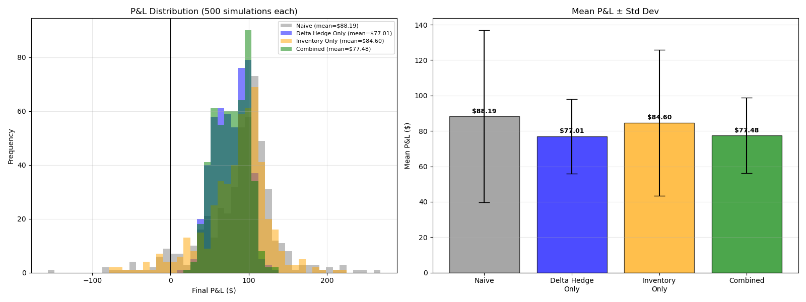

# Options Market-Making Simulator

A simulation of options market making implementing the Avellaneda-Stoikov (2008) 
inventory management framework on a European call option. The core question: 
which risk management tool matters more for an options market maker — 
delta hedging or inventory management — and do they compound or cancel each other out?

## The Four Strategies

To isolate the contribution of each risk management tool, the simulator runs a 
2x2 comparison across 1,000 simulated 30-day trading periods:

| Strategy | Quoting | Hedging |
|---|---|---|
| Naive baseline | Symmetric (mid +/- spread/2) | None |
| Delta hedge only | Symmetric | Continuous delta hedge |
| Inventory management only | AS reservation price | None |
| Combined | AS reservation price (scaled) | Continuous delta hedge |

## Results

| Strategy | Mean P&L | Std P&L | Sharpe | % Positive |
|---|---|---|---|---|
| Naive baseline | $[RESULT] | $[RESULT] | [RESULT] | [RESULT]% |
| Delta hedge only | $[RESULT] | $[RESULT] | [RESULT] | [RESULT]% |
| Inventory management only | $[RESULT] | $[RESULT] | [RESULT] | [RESULT]% |
| Combined | $[RESULT] | $[RESULT] | [RESULT] | [RESULT]% |

All results reported with 95% confidence intervals via CLT: CI = mean +/- 1.96 * (std / sqrt(n)).



## Key Finding

[Fill in after results]

## Methodology

### Simulation Environment

- Underlying: stock price simulated via Geometric Brownian Motion at one-minute 
  resolution over 30 trading days (11,700 timesteps per simulation)
- Option: 30-day European call, ATM (S=K=$100), 20% annualized vol, 5% risk-free rate
- Option pricing: Black-Scholes recomputed at every timestep as stock price and 
  time-to-expiry evolve, tracking delta, gamma, vega, and theta throughout the 
  full option life cycle

### Stock Price Model

Stock price follows Geometric Brownian Motion:

    S(t + dt) = S(t) * exp((mu - sigma^2 / 2) * dt + sigma * sqrt(dt) * Z)

where Z ~ N(0,1). The sigma^2/2 term is the Ito correction — without it, 
the expected price would grow faster than exp(mu * t) due to Jensen's inequality 
applied to the exponential function.

### Order Flow Model

Two independent Poisson processes simulate order arrivals:

Noise traders arrive at rate lambda = A * exp(-kappa * distance from mid).
The exponential decay means traders are less likely to fill quotes the further 
they are from fair value. The probability of at least one arrival in timestep dt is:

    P(arrival in dt) = 1 - exp(-lambda * dt)

This follows directly from the memoryless property of the Poisson process 
(MIT 6.041, Lectures 13-15).

Informed traders arrive at a lower constant rate A_informed, regardless of 
quote distance — they trade because they have information, not because of price 
attractiveness. When an informed trader fills, the stock price immediately jumps 
in their direction by ETA * sigma / sqrt(252), creating adverse selection losses.

### Avellaneda-Stoikov Quoting

The AS framework derives two equations for optimal quoting:

Reservation price — adjusts mid for inventory risk:

    r = mid - q * gamma * sigma^2 * (T - t)

When inventory q is positive (long contracts), reservation price falls below mid, 
skewing both bid and ask down to attract sellers and reduce inventory. When q is 
negative (short), reservation price rises above mid.

Optimal spread — balances inventory risk against fill probability:

    spread = gamma * sigma^2 * (T - t) + (2 / gamma) * ln(1 + gamma / kappa)

The first term widens with volatility, risk aversion, and time remaining. 
The second term accounts for order arrival dynamics — how sensitive arrivals 
are to distance from mid.

Quotes are then placed symmetrically around the reservation price:

    bid = r - spread / 2
    ask = r + spread / 2

For the combined strategy, the inventory skew is scaled by SKEW_WEIGHT = 0.5 
to prevent double-counting with the delta hedge. Both tools address directional 
inventory risk, so applying both at full strength is redundant.

### Delta Hedging

After every timestep, the model trades the underlying stock to neutralize 
delta exposure:

    hedge_shares = -inventory * option_delta

This removes directional stock exposure from the P&L, isolating returns to 
spread capture and gamma/vega risk rather than unhedged directional moves.

### Mark-to-Market P&L

At every timestep:

    P&L = cash + inventory * option_mid + hedge_shares * stock_price

This is the honest measure of performance — it accounts for the current value 
of all open positions, not just realized cash flows.

### Statistical Validation

Results are reported with 95% confidence intervals using the Central Limit Theorem 
(MIT 6.041, Lectures 19-20). With n = 1,000 independent simulation runs, the 
distribution of mean P&L is approximately normal by CLT, and the confidence 
interval is:

    CI = mean +/- 1.96 * (std / sqrt(n))

With n = 1,000, the standard error is std / sqrt(1000) = std / 31.6, giving 
tight confidence intervals that reliably distinguish strategies.

## Project Structure

├── black_scholes.py # Black-Scholes pricer and Greeks
├── market_maker.py # AS quoting engine, order arrival models
├── simulate.py # simulation loop, four strategies, analysis, plotting
└── requirements.txt

## Setup

```bash
pip install -r requirements.txt
python simulate.py
```

## Parameters

| Parameter | Value | Description |
|---|---|---|
| S0 | $100 | Initial stock price |
| K | $100 | Strike price (ATM) |
| T | 30 days | Option expiry |
| sigma | 20% | Annualized volatility |
| mu | 5% | Stock drift |
| gamma | 0.01 | AS risk aversion parameter |
| kappa | 10.0 | Order arrival sensitivity to distance from mid |
| A | 0.001 | Noise trader arrival rate (per minute) |
| A_informed | 0.00005 | Informed trader arrival rate (per minute) |
| eta | 1.2 | Informed trader price impact multiplier |
| SKEW_WEIGHT | 0.5 | Inventory skew scaling in combined strategy |

## Connection to Theory

Poisson process (MIT 6.041 Lectures 13-15): order arrivals modeled as Poisson 
processes. The probability of at least one arrival in timestep dt is 
1 - exp(-lambda * dt), derived from the memoryless property of exponential 
inter-arrival times. Noise trader arrival rate decays exponentially with 
distance from mid; informed trader rate is constant.

Central Limit Theorem (MIT 6.041 Lectures 19-20): with 1,000 independent 
simulation runs, the distribution of mean P&L is approximately normal by CLT, 
allowing confidence interval construction via CI = mean +/- 1.96 * std / sqrt(n).

Black-Scholes: fair value and Greeks recomputed at every timestep throughout 
the full 30-day option life cycle. Delta is used for hedging; gamma and vega 
are tracked as residual risk exposures after hedging.

Geometric Brownian Motion: stock price update uses the Ito-corrected formula 
S(t+dt) = S(t) * exp((mu - sigma^2/2) * dt + sigma * sqrt(dt) * Z), ensuring 
the expected price grows at rate mu rather than mu + sigma^2/2.

## Requirements

numpy
scipy
matplotlib
